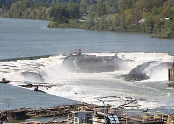

```{r setup, include=TRUE, warning = FALSE, message = FALSE}
knitr::opts_chunk$set(echo = TRUE, message = FALSE, warning = FALSE)

library(tidyverse)
library(here)
library(janitor)
library(tsibble)
library(feasts)
library(broom)
library(fable)
library(lubridate)
```

### Task 2: Willamette Falls fish passage time series summary 

{width="45%"}

{width="30%"}

### Overview {.tabset}
This task explores time series data in 3 parts based on Willamette Falls fish passage data from Columbia River DART (Data Access in Real Time) from the University of Washington. First a time series of fish passage for adult coho, jack coho, and steelhead salmon, second each species passage is analyzed in its own season plot, and finally we analyze the annual total fish passage for each of the 3 species. 

Data Citation: 
Columbia Basin Research, University of Washington. 2010. DART Adult Passage Graphics & Text.

```{r}
#read in data
fish_passing <- read_csv(here("_posts", "time-series-analysis", "willamette_fish_passage.csv")) %>% 
  clean_names()
```

#### Original time series

```{r}
#create time series
fish_ts <- fish_passing %>% 
  clean_names() %>% 
  mutate_all(funs(ifelse(is.na(.), 0, .))) %>% 
  mutate(date = mdy(date)) %>% 
  select(date, coho, jack_coho, steelhead) %>% 
  as_tsibble(key = NULL,index = date)

fish_ts_pivot <- fish_ts %>% 
  pivot_longer(c(coho, jack_coho, steelhead),
               names_to = "species",
               values_to = "count") %>% 
   mutate(species = case_when(
    species == 'coho' ~ "Coho",
    species == 'jack_coho' ~ "Jack Coho",
    species == 'steelhead' ~ "Steelhead"))
```

```{r}
#plot time series 
ggplot(data = fish_ts_pivot,
       aes(x = date,
           y = count)) +
  geom_line(aes(color = species), alpha = .85) +
  scale_color_manual(values = c('coral', 'darkolivegreen3','cornflowerblue')) +
  scale_x_continuous(n.breaks = 10) +
  labs(x = 'Date',
       y = 'Number of Fish',
       title = "Salmon Species Use of Willamette Falls Fish Ladder") +
  theme_minimal()
```

**Figure 1.** This figure shows fish ladder use at the Willanette Falls ladder by Coho, Jack Coho, and Steelhead as counts by month between 2001 and 2010.

##### Analysis Conclusions
  - Coho salmon had the highest ladder usage in 2009 and 2010.
  - Jack Coho salmon has been consistently the least frequent user of the fish ladder. 
  - Steelhead salmon were the most frequent user until 2009, and overall have been consistent users of the fish ladder. 
  - The sudden spike in coho salmon ladder use may indicate a change in coho population or environmental conditions that should be explored further. 


#### Seasonal Analysis

```{r}
#seaon plots for fish species
fish_ts_pivot %>% 
  gg_season(y = count) +
  labs(y = "Amount of Fish",
       x = "Month",
       color = 'Year',
       title = "Seasonal Salmon Ladder Use by Coho, Jack Coho, and Steelhead Salmon") +
  theme_minimal()
```

**Figure 2:** Seasonplot of salmon run monthly variation for each species each year from 2001-2010 at the Wilamette Falls fish ladder.

##### Analysis Conclusions
  - Jack Coho and Coho salmon use the fish ladder in the fall, from approximately August through Spetember with the highest usage spike in October.
  - Coho and Jack Coho had fairly similar usage until recently, Coho salmon now (2010) have higher usage than Jack Coho, this is consistent with the annual and time series analyses. 
  - Steelhead salmon use the fish ladder primarily from January August with the largest spike in June, however there is another small spike in usage around November.
 
#### Annual Species Count
```{r}
fish_ts_annual <- fish_ts_pivot %>% 
  index_by(year = ~year(.)) %>% 
  group_by(species) %>% 
  summarize(yearly_count = sum(count))

ggplot(data = fish_ts_annual, aes(x = year, y = yearly_count)) +
  geom_line(aes(color = species)) +
  scale_color_manual(values = c('coral', 'darkolivegreen3','cornflowerblue')) +
  scale_x_continuous(n.breaks = 10) +
  labs(title = "Annual Counts of Fish Ladder Passage by Salmon Species",
       x = "Year",
       y = "Number of Fish",
       fill = "Salmon Species") +
  theme_minimal()
```
 
**Figure 3.** Annual number of fish passages at Willamette Falls fish ladder from 2001-2010 for each species of salmon. 

##### Analysis Conclusions
  - Coho and Jack Coho had relatively similar usage until Coho ladder usage suddenly spiked around 2008 to 2009, however it appears to decline again in 2010. 
  - Jack Coho have the most consistent usage over the year, even if it is consistently the lowest. 
  - Steelhead salmon were the most frequent users, however usage has declined fairly consistently. This could correlate to population decline and should be studied further. 
  
  


